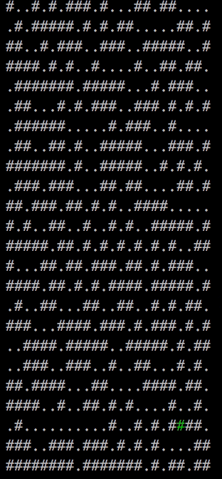

# Day 10: Monitoring Station

## Problem Summary ([?](https://adventofcode.com/2019/day/10))

The problem input contains a map of asteroids, denoted by `#`s.
From any given point we can only see asteroids that are not exactly obscured by others.
The asteroids only take up a point of space for the purposes of visibility.

**Part 1** tasks us with finding the asteroid "X" from which the most other asteroids can be seen.
The solution is the number of asteroids that can be seen from there.
The answer for my input is 247.

**Part 2** has us enumerate the asteroids that are visible from X, in clockwise order.
When an asteroid obscures another we only take the closest one on the first pass, grabbing the next only after a full rotation.
The solution is the coordinate of the 200th asteroid enumerated.
The answer for my input is (19, 19), concatenated as 1919.

## Retrospective

For part 1, I first implemented a solution enumerating velocities, but that didn't dedupe multiples.
I didn't want to have to handle infinite slope or normalize components, and I was hesitant to just [`atan2`](https://docs.python.org/3/library/math.html#math.atan2) it, using irrational floats as dict keys.
But `atan2` was simplest so I decided to give it a shot, and it worked great.

For part 2 especially I guessed too much, threw too many unsure answers against the submission.
There's definitely something to be said about just trying a solution, but at a certain point I should've realized it was time to start debugging.
Having a debug view helped a lot.
I think a different approach may have been easier to reason about, but I simply messed with my `atan2` arguments until Up was the smallest angle and it rotated clockwise.
I also had to special-case Up: my angles were in the range `(-π, π]` when I needed Up to come first, needed them to be `[-π, π)`.
This was super gross.

I didn't end up placing, but i liked this problem a lot.
Simple definition but a surprisingly tricky puzzle, and a lot of tricky details to get wrong.

Also I [formalized my visualization](visualize.py).
I think it looks cool!

