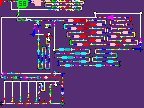

# Day 16: Packet Decoder

**Language: [Piet](https://www.dangermouse.net/esoteric/piet.html)**

## Usage

Various Piet compilers and interpreters can be found at https://www.dangermouse.net/esoteric/piet/tools.html .
I have also included a [`piet`](piet) interpreter which implements all the features from the spec necessary for my solution, modified from [the version] on the site.

```bash
python3 -m pip install numpy Pillow

cat file.txt | tr -d '\n' | ./piet -v part1.gif
cat file.txt | tr -d '\n' | ./piet -v part2.gif
```

Note that part 1 takes like a full minute to run, because of the way the interpreter has to re-explore the 4096 constant every time.

## Problem Summary ([?](https://adventofcode.com/2021/day/16))

The puzzle input contains a bunch of hexadecimal digits to be interpreted as bits.
The bits encode a "packet", which contains some subpackets (which may contain subpackets, etc), which describe a mathematical expression.

A packet always begins with three bits for the **version id**, then three bits for the **type id**:
- If the type id is 4 this packet describes a literal numeric value.
  We read five bits at a time: the leading bit denotes if this is the final chunk, and the other four add to the value.
- If the type id is not 4 this packet describes an operator, which contains some subpackets.
  The next bit describes how to determine how many subpackets:
  - If it is 1, the next 11 bits are an integer describing the number of direct subpackets.
  - If it is 0, the next 15 bits are an integer describing the number of bits in this subpackets descendents.
  The operators are `sum`, `product`, `minimum`, `maximum`, `greater than`, `less than`, and `equal to`.

**Part 1** asks us to find the sum of all the version ids.
The answer for my input is 955.

**Part 2** asks us to evaluate the result of the expression.
The answer for my input is 158135423448.

## Solution

<table>
<tr><th>Part 1</th><th>Part 2</th></tr>
<tr><td></td><td></td></tr>
</table>

## Retrospective

Piet is a 2D programming language which uses images as source files.
Logically, a running Piet program maintains a Direction Pointer, which is a position and cardinal direction on the image.
The DP follows some rules to move between contiguous colored blocks.
The relative differences between the two colored blocks determines which of Piet's 17 different commands is executed.

Piet's memory model is a single stack.
Commands operate on the elements on top of the stack.
There is a `roll` command to rotate a portion of the top of the stack.

Piet's a tough language to use.
Wrestling with the stack is hard enough, but doing so while debugging color typos or even just trying to work out how to turn left sounds very difficult indeed.
I split up the solve of this one into two parts.

I first built out a solution in Python, using only commands that are available in Piet.[^pieter]
Even just reading the input was tricky.
I definitely wanted to get the input reading out of the way first, not have to worry about it mid-program.
But I didn't want to put the digits on the stack, and have to dig around in the stack to fish them out.
Instead, I noticed that stripping trailing 0s at the end of the integer is a lot like stripping leading 0s from the start of a number.
From the input of 1356 hex characters, I construct a 5424-bit integer with the bits reversed, to keep as a single entry on the stack.
Then I can `divmod 2` a bit at a time off of it.
This is a bit cumbersome, but I think less cumbersome than any other solution I thought of.

Once I had interpreted the input, summing the version ids was involved, but not too difficult.
Actually evaluating the expression in part 2 was much trickier.
I wanted to avoid tricky indexing into a complex and arbitrarily-sized tree structure on the stack.
I noticed all the multi-argument operators were commutative + associative, which meant I could apply literals to the operators as soon as I encountered them.
That meant I could maintain a non-branching stack of in-progress operators.
Each operator on the stack is represented by five values.
In order:
- the type id
- the subpacket count remaining. Defaults to 0
- the number of subpacket bits remaining. Defaults to 0
- the number of bits total in this packet (the headers + the bits in its subpackets)
- the in-progress aggregate value
Then it's just a question of maintaining those frames, and popping the top one and combining it with the next frame down whenever one of the counters hits _exactly_ zero (this means an initial 0 value will never trigger).

After getting the algorithm together, I transcribed the text into an image with [GIMP](https://www.gimp.org/).
It's not an easy process!
It's easy to place down the wrong color accidentally, which is tough to identify at a glance and usually requires stepping through the output to even locate.
I think this would have been a real problem without the reference implementation to compare against.
Even just turning left in Piet is a production.
The DP naturally wants to turn right, so extra care needs to be taken to avoid going back up the path you just came from.

The big "4096" in part 1's solution is composed of exactly 4096 pixels[^codels].
It's used to push the number 4096 onto the stack.
There are more space-efficient ways to represent this, which I took better advantage of in part 2 (where it seemed that space would be less of a luxury), but I thought it would be a fun little idea.
Unfortunately the interpreter I was using was trying to find the size of a block recursively, which was causing a stack overflow.
I edited it to run iteratively, though it still runs every time it encounters the block when it really should cache it.

This took a long time to write!
I liked the idea of writing a solution in Piet, and when it became clear a Piet solution could be feasible I latched onto it.
It might be fun to explore Piet further in the future, especially building out some dev tooling for it, but I need to spend some time not writing Piet now.

[^codels]: codels
[^pieter]: You can see these Python scripts in `pieter1.py` and `pieter2.py`. They are rough code, but may share some insight as to what the Piet code is doing.
